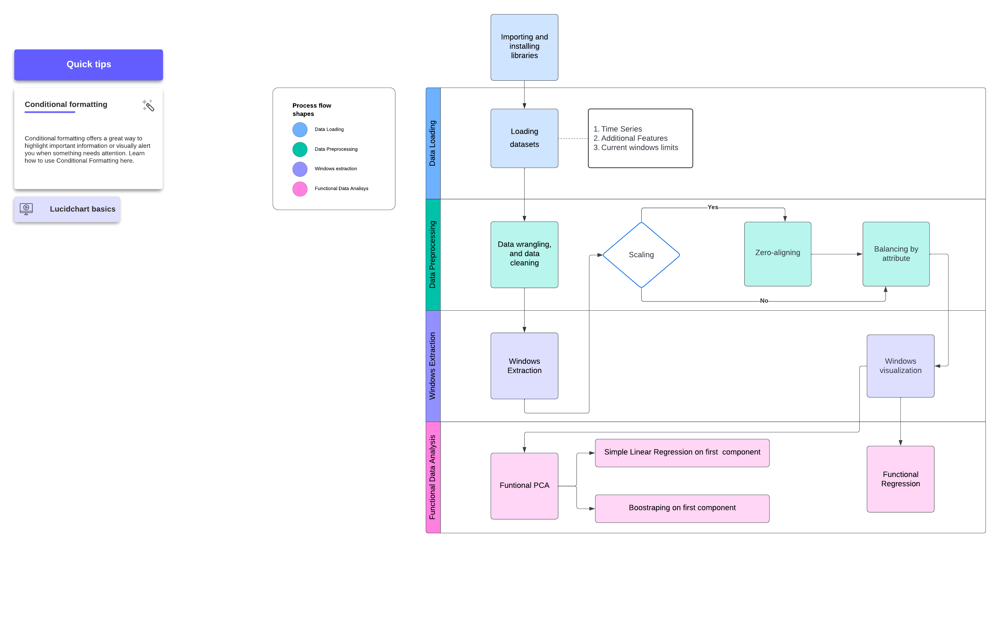

# Main task: Waveforms characterization

Pipeline

## Prerequisites
### Installation
-   Install scikit-fda using `!pip install scikit-fda`
-   Install
### Description of the content of the 4 pre-designed functions
### Data
## Results
### Windows viz
### FPCA (split into 3)
### Table slopes comparison
### Functional Regression plot
## Citation FDA Library
