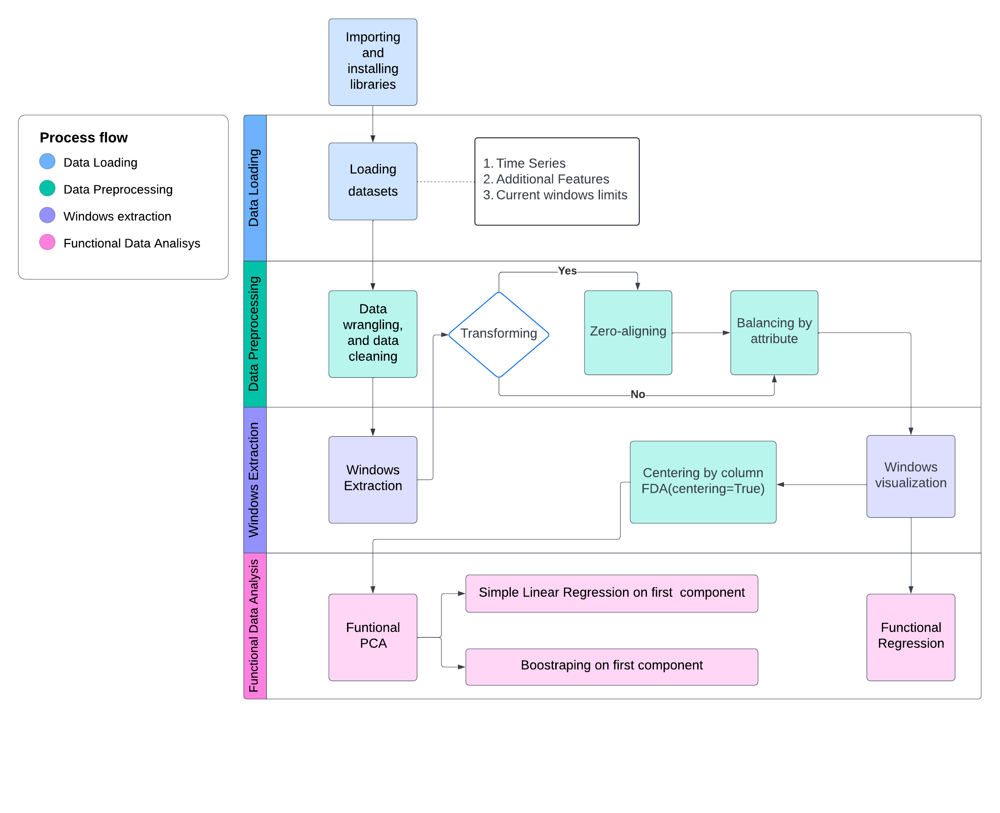

# Main task: Waveforms characterization

### Project structure

* **FDA_Resampling/**
  * **RawData/**
  * [**Centering_by_ColumnMeans/**](https://github.com/dejaytang/Capstone_Siemens/tree/main/Coding/FDA_Resampling/Centering_by_ColumnMeans)
     *   **Python/**
         * `RawData_CardAge.py`
         * `RawData_FluidTemperature.py`
         * `RawData_FluidType.py`
     *  **HTML/**
     *  **JupyterNotebook/**
  * [**StartingPoints_ZeroAligned/**](https://github.com/dejaytang/Capstone_Siemens/tree/main/Coding/FDA_Resampling/StartingPoints_ZeroAligned)
      * **Python/**
          * `ZeroStart_CardAge.py`
          * `ZeroStart_FluidTemperature.py`
          * `ZeroStart_FluidType.py`
      * **HTML/**
      * **JupyterNotebook/**
  * `time_series_visualization.py`
  * `window_extraction.py`
  * `functionalPCA.py`
  * `functional_regression.py`

## Prerequisites

The code was written in Python and can be run on terminal using the '.py' files or Jupyter notebook using '.ipynb' files. For quick access to visualize the results 'HTML' files are included. 

### Installation

- Use the  library [scikit-fda](https://fda.readthedocs.io/en/latest/): `pip install scikit-fda`
 
- Clone this repo:
```bash
git clone https://github.com/dejaytang/Capstone_Siemens
cd Capstone_Siemens/FDA_Resampling
```
### Import RawData
Please place the datasets named `Key by TestID.csv`, `SensorA_System1_missing values.csv`, `SensorA_System2_missing values.csv`, `System1_SensorA.csv`, `System1_SensorB.csv`, `System2_SensorA.csv`, and `System2_SensorB.csv` into the **RawData** folder.

### Usage custom functions

To use the functions defined in `time_series_visualization.py`, `window_extraction.py`, `functionalPCA.py`, and `functional_regression.py` in the RawData_attribute.py and ZeroStart_attribute.py files, ensure to have them within the FDA_Resampling folder as shown in the project structure.

**General Description**

1. `time_series_visualization.py`: Include three functions created for time series visualization.
   * `plot_all_time_series`: Plot all the time series from a dataframe, where every row is a time series.
   * `plot_all_time_series_and_mean_fpca`: Plot all the time series from a data frame and an additional time series(the default is the mean of all the time series). For the additional time series, two values must be provided, 'x_new' which is the array of timestamps and 'y-new' which is the array of values frome the timeseries.
   * `plot_all_time_series_in_group`: Plot time series data from four dataframes in a 2x2 grid of subplots.

2. `window_extraction.py`: Compress four functions related with the window extraction and data preprocessing steps.
   
   * `calculate_window_values`: Calculate the start and end values for calibration and sample windows.
   * `calculate_window_data`: Extract calibration and sample window data from a given row of time series data.
   * `Merge_data`: Merge de data from the window extraction with the attributes of interest.
   * `align_to_zero`: Align each column of the DataFrame to its first value (zero index) by subtracting the first column from all subsequent columns.
   * `balance_index`: Balance the dataset based on the features taking the minimum number of waveforms per bin.

4. `functionalPCA.py`: Include five functions for performing Functional Principal Component Analysis (FPCA), bootstrapping, visualizing the results, and calculating slopes.
   * `fpca_two_inputs`: Perform Functional Principal Component Analysis (FPCA) on two sets of time series data from system 1 and system 2. Then, plot the first and second principal components along with the mean function (using `plot_all_time_series_and_mean_fpca`). Additionally, print the explained variance ratio and identify the time series that contribute most to each principal component.
   * `first_component_extraction`: Extract the first principal component from two sets of time series data using FPCA.
   * `bootstrap`: Conduct bootstrap resampling on the FPCA analysis using data from two systems, visualize the confidence intervals and the mean of all the first components, and generate a functional boxplot to ensure the stability of the first component.
   * `create_pc_scores_plots`: Generate scatterplots for the functional principal component scores, coloring points based on focusing features, and print TestIDs with extreme scores in two systems.
   * `visualize_regression`: Calculate the slopes of the regression lines for two systems' data.

6. `functional_regression.py`:
   * `Function_regression`: Perform functional regression by converting input time series data into functional data with a Fourier basis, fitting a regression model, printing all coefficients, and returning the fitted linear regression model (LinearRegression object).
   * `coefficent_visualization`: Visualize coefficients of two functional regression models over a specified interval, focusing on features confirmed by Function_regression's output.

You can import the functions using the following code:

```bash
from time_series_visualization import plot_all_time_series, plot_all_time_series_and_mean_fpca, plot_all_time_series_in_group
from window_extraction import calculate_window_values, calculate_window_data, Merge_data, align_to_zero, balance_index
from functionalPCA import fpca_two_inputs, first_component_extraction, bootstrap, create_pc_scores_plots, visualize_regression
from functional_regression import Function_regression, coefficent_visualization
```

## Pipeline

The following diagram shows the pipeline for the main task of waveform characterization, which has four main steps: data loading, data preprocessing, windows extraction and Funntional Data Analysis.



## Results
To briefly introduce the results in the file, we use the feature `Fluid_Temperature` from Sensor A's calibration window, demonstrating the expected plots after code execution:

**Windows visualization**


**Functional PCA**

- Visualization of waveforms and the mean function:
- Visualization of the first two eingenfunctions (principal components):
- Visualizing the comparison of the first component across different systems:
- Visualization of the mean and boxplots of the first component:
- Visualization of the eigenvalues (scores) colored-mapping by attributes:
- Simple Linear Regression slopes comparison:
  
  

**Functional Regression**
- Visualization of Functional Regression coefficients:

