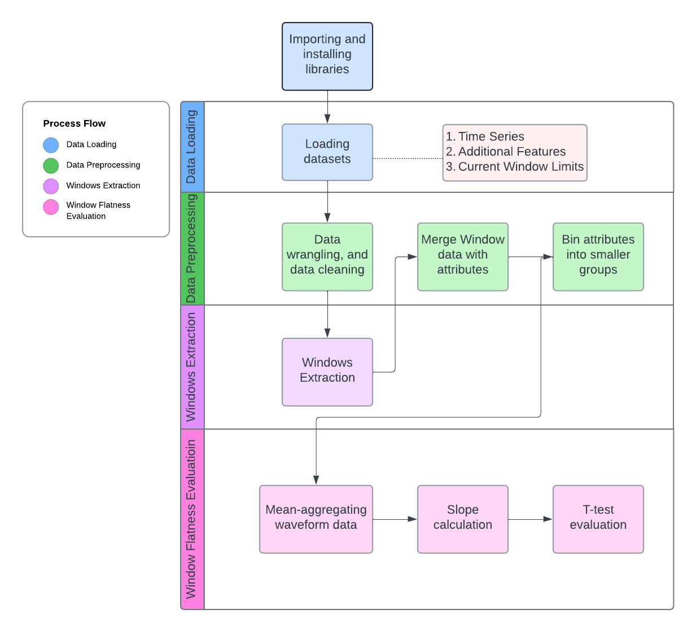
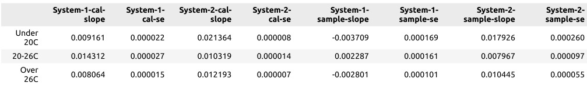
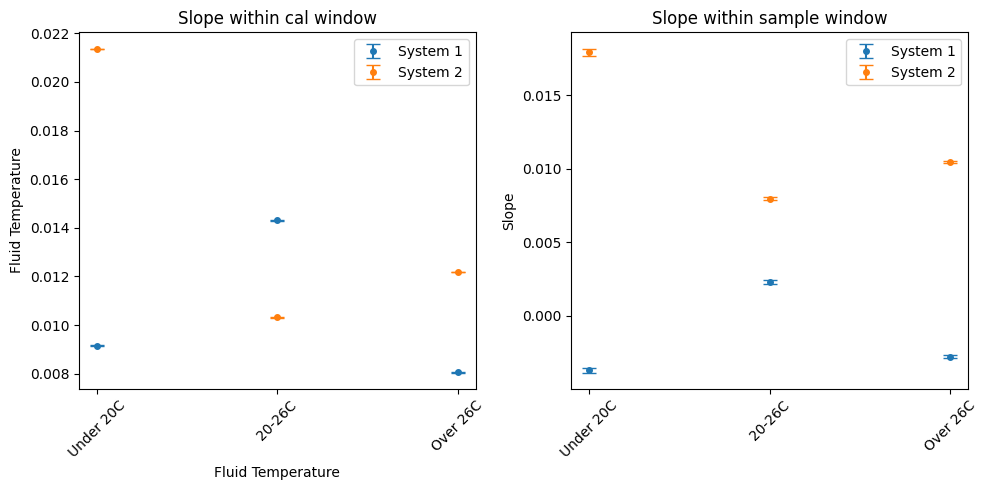
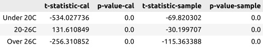
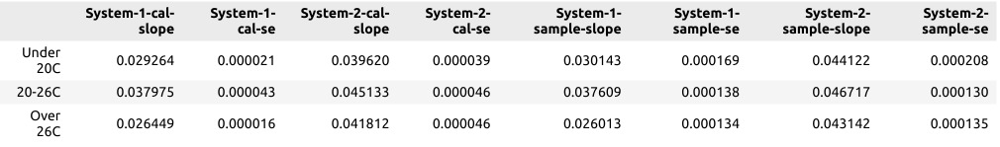
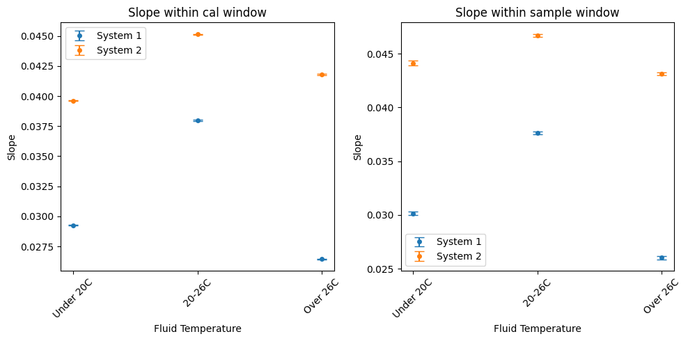
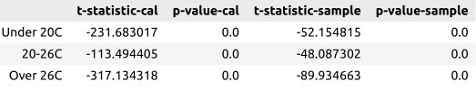

# Main task: Waveforms characterization

### Project structure

* **Raw_Slope/**
  *   **RawData/**
  *   **Python/**
      * `RawData_CardAge.py`
      * `RawData_FluidTemperature.py`
      * `RawData_FluidType.py`
   *  **HTML/**
   *  **JupyterNotebook/**
  * `raw_slope_functions.py`


## Prerequisites

The code was written in Python and can be run on terminal using the '.py' files or Jupyter notebook using '.ipynb' files. For quick access to visualize the results 'HTML' files are included. 

### Installation
 
- Clone this repo:
```bash
git clone https://github.com/dejaytang/Capstone_Siemens
cd Capstone_Siemens/Raw_Slope
```
### Import RawData
Please place the datasets named `Key by TestID.csv`, `SensorA_System1_missing values.csv`, `SensorA_System2_missing values.csv`, `System1_SensorA.csv`, `System1_SensorB.csv`, `System2_SensorA.csv`, and `System2_SensorB.csv` into the **RawData** folder.

**General Description**

1. `raw_slope_functions.py`: Include three functions created for slope flatness evaluation.
   * `calculate_slopes_se`: Calculate slopes and standard errors (SE) of linear regression models for aggregated data across different labels.
   * `run_ttest`: Perform independent two-sample t-tests between System-1 and System-2 based on slopes and standard errors (SE).

You can import the functions using the following code:

```bash
from raw_slope_functions import calculate_slopes_se, run_ttest
```

## Pipeline

The following diagram shows the pipeline for the main task of waveform characterization, which has four main steps: data loading, data preprocessing, windows extraction and window flatness evaluation.



## Results
To briefly introduce the results in the file, we use the feature `Fluid_Temperature` from Sensor A and B's calibration and sample window, demonstrating the expected plots after code execution:

### **Sensor A**
- slope and standard error: 

- slope visualization: 

- T-test result assessing difference in slope between System 1 and 2: 

### **Sensor B**
- slope and standard error: 

- slope visualization: 

- T-test result assessing difference in slope between System 1 and 2: 
