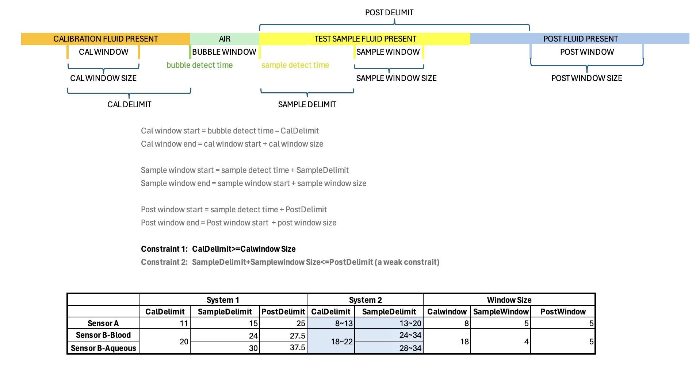
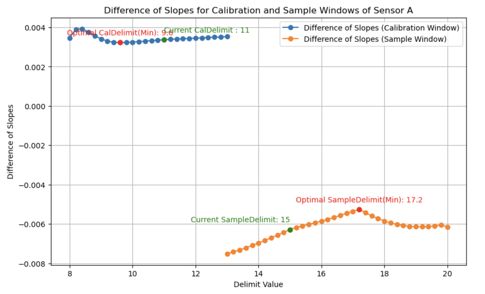
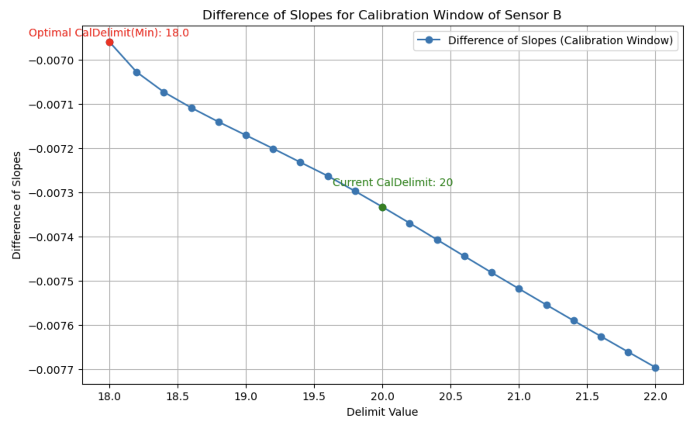
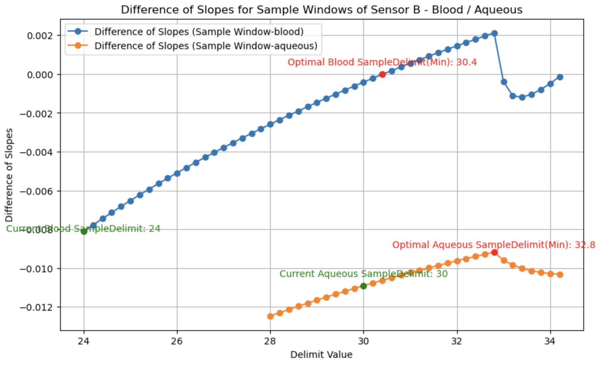

# Additional Task: Window Optimization
## 1. Project Structure
- Window_Optimization
  - Window_Optimization.ipynb
  - Window_Optimization.py
  - Window_Optimization.html
- FDA_Resampling_New_window
- Raw_slope_New_window

## 2. Window Optimization
### 2.1. Diagram

### 2.2. Main Idea
Optimized the calibration window and the sample window of Sensor A and Sensor B in System 2 
by creating a function that minimizes the regression slopes between System 1 and System 2 
while keeping moving the current windows within certain limits. 

### 2.3. Visualization Results

## 3. Raw Slope on New Windows
Applied new window delimits of system 2 for slope calculations on raw data.
See details at https://github.com/dejaytang/Capstone_Siemens/blob/main/Coding/Raw_Slope/README.md

## 4. FDA Resampling on New Windows
Applied new window delimits of system 2 for functional data analysis on balanced data.
See details at https://github.com/dejaytang/Capstone_Siemens/blob/main/Coding/FDA_Resampling/README.md
